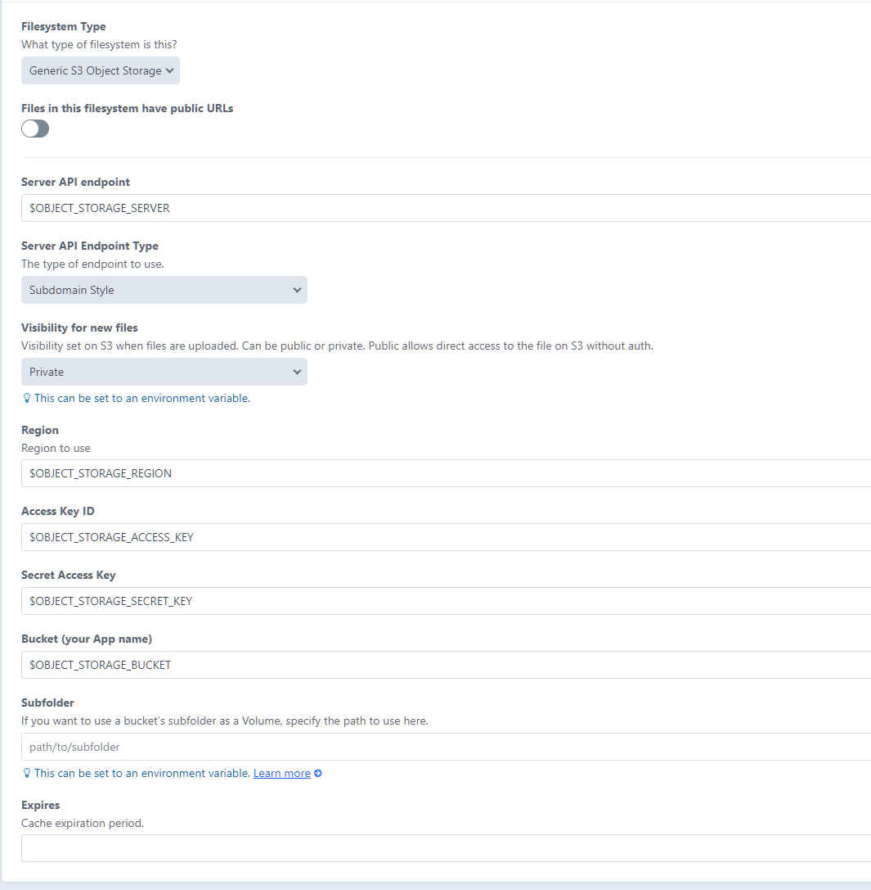

# Generic Object Storage Volume for Craft CMS

This plugin provides a S3 (Object) storage integration for [Craft CMS](https://craftcms.com/).

- Supports path style S3 and subdomain style S3.
- Visibility can also be set independently per filesystem.



## Requirements
- PHP 8.0
- Craft 5.0

## Installation
To install the plugin.


### Install the plugin via composer
```
composer require behinddesign/craft-object-storage
```

### Update your local .env file (Optional, set these during configuration of Filesystem)
```
OBJECT_STORAGE_BUCKET="my-bucket"
OBJECT_STORAGE_HOST="my-bucket.my.s3.host.com"
OBJECT_STORAGE_HOST_TYPE="subdomain"
OBJECT_STORAGE_VISIBILITY="private"
OBJECT_STORAGE_MAKE_UPLOADS_PUBLIC="true"
OBJECT_STORAGE_REGION="eu-west-1"
OBJECT_STORAGE_ACCESS_KEY="accesskey"
OBJECT_STORAGE_SECRET_KEY="secretkey"
OBJECT_STORAGE_SERVER="Your S3 Host"
```

### Install the plugin
```
php craft plugin/install behinddesign-craft-object-storage
```

Or browse to  CP > Settings > Plugins to enable the plugin.

### Configure
Within Settings -> Filesystems -> Add / Edit a filesystem

The dropdown for 'Filesystem Type' will now contain 'Generic S3' as an option.

## Thanks!
[fortrabbit](https://github.com/fortrabbit/craft-object-storage) The base setup for the S3 integration made significantly
easier with their plugin. Added extra features which allow for a generic integration such as path style endpoints, the ability
to select visibility. This means integration with [minio](https://min.io) is much easier.
